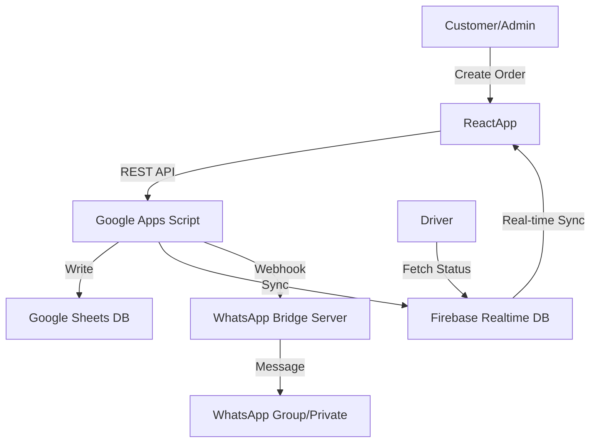

# 🚖 Taxi Bridge System: Overview & Strategy
**Last Updated: April 2026**

## 1. Executive Summary
The **WhatsApp Taxi Bridge** is a high-availability, low-cost dispatching solution designed for taxi stations. It integrates WhatsApp automation with a robust Google-based cloud backend, providing real-time data synchronization for dispatchers, drivers, and passengers.

### Key Goals:
- **Zero Downtime**: Multi-channel fallback (WhatsApp -> Telegram -> Email).
- **Zero Infrastructure Cost**: Built on Google Apps Script (GAS), Firebase (Free), and Render (Free/Starter).
- **Scale**: Supports hundreds of drivers and thousands of orders daily.

---

## 2. System Architecture (Technical Spec)

### Hybrid Hub-and-Spoke Model:
1.  **Google Apps Script (GAS)**: The central "Brain". Manages business logic, authentication, and Google Sheets database.
2.  **Firebase Realtime DB**: The "Speed Layer". Syncs orders and driver locations in real-time across all apps.
3.  **WhatsApp Bridge (Node.js)**: The "Worker". Bridges the gap between GAS and the WhatsApp Web API.
4.  **React Frontend**: Modern PWA interfaces for Admin, Driver, and Passenger.

### Data Flow Diagram:

---

## 3. Core Principles
- **Single Source of Truth**: All permanent data resides in **Google Sheets**. Firebase is a cache.
- **Atomic Operations**: Uses `LockService` to prevent race conditions during order acceptance.
- **Privacy (PII)**: Customer phone numbers are masked in server logs and hidden from drivers until payment is confirmed.
- **Fail-Safe Routing**: The system automatically toggles between a Local Bridge (for speed) and a Cloud Bridge (for reliability).

---

## 4. Business Strategy
- **Market Positioning**: Targeted at small-to-mid taxi stations transition from voice-only to digital-first dispatching.
- **Cost Efficiency**: Leveraging serverless technologies to maintain a near-zero recurring cost profile.
- **Modern UX**: Designed with a "premium first" aesthetic to build trust with both drivers and passengers.

---

## 5. Master Prompt & Knowledge Basis
The system is built to be "Agent-Ready," containing structured logging and documentation that allows AI agents to maintain and debug the code autonomously using defined protocols.
